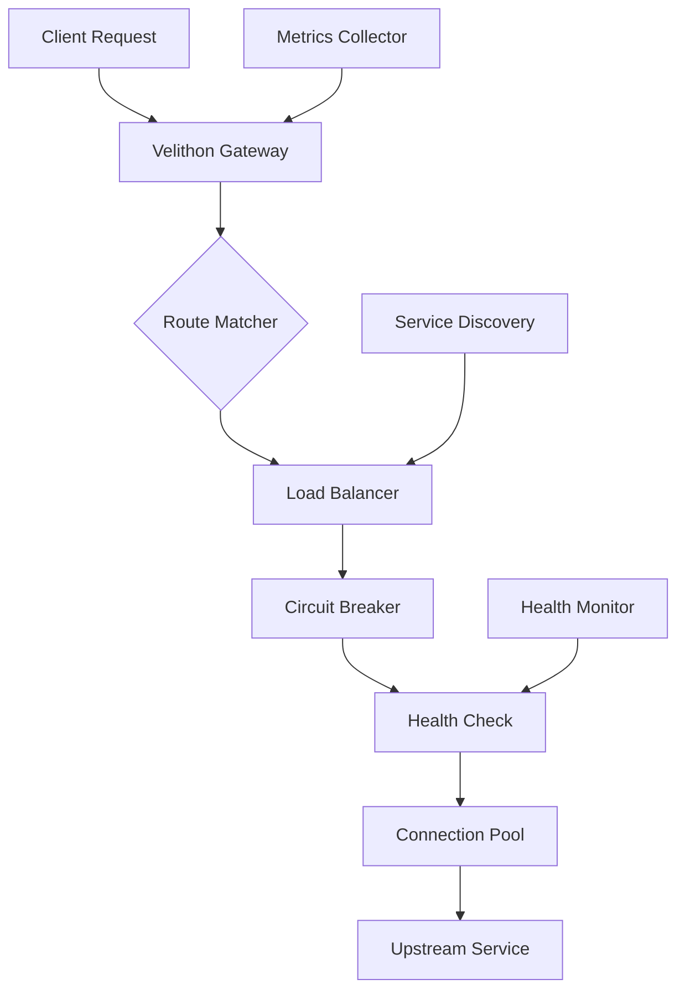

# Gateway & Proxy

Velithon provides powerful gateway and proxy capabilities implemented in Rust for maximum performance. The system includes load balancing, circuit breakers, health checking, and intelligent request routing.

## 🌟 Features

- **High Performance**: Rust-based proxy client using hyper
- **Load Balancing**: Round-robin, random, and weighted strategies
- **Circuit Breaker**: Built-in circuit breaker pattern for resilience
- **Health Checking**: Automatic monitoring of upstream services
- **Connection Pooling**: Efficient connection reuse
- **Request Forwarding**: Simple request forwarding to backend services
- **Path Manipulation**: Basic path rewriting capabilities
- **Header Manipulation**: Add/remove headers during forwarding

## 🏗️ Gateway Architecture



## 🚀 Quick Start

### Basic Gateway Setup

```python
from velithon import Velithon
from velithon.gateway import Gateway, GatewayRoute

app = Velithon()

# Create gateway instance
gateway = Gateway()

# Add a simple forwarding route
route = GatewayRoute(
    path="/api/{path:path}",
    targets="http://api-service:8080"
)

# Add route to application
app.routes.append(route)
```

### Advanced Gateway Configuration

```python
from velithon.gateway import Gateway, GatewayRoute

# Create gateway route with load balancing
route = GatewayRoute(
    path="/api/{path:path}",
    targets=[
        "http://api-1:8080",
        "http://api-2:8080", 
        "http://api-3:8080"
    ],
    load_balancing_strategy="round_robin",
    health_check_path="/health",
    timeout_ms=30000,
    max_retries=3
)

# Create gateway and add route
gateway = Gateway()
gateway.routes.append(route)
```

## 🔀 Load Balancing

### Round Robin Strategy

```python
from velithon.gateway import GatewayRoute

# Round-robin load balancing (default)
route = GatewayRoute(
    path="/service/{path:path}",
    targets=[
        "http://service-1:8080",
        "http://service-2:8080",
        "http://service-3:8080"
    ],
    load_balancing_strategy="round_robin"
)
```

### Weighted Strategy

```python
from velithon.gateway import GatewayRoute

# Weighted load balancing
route = GatewayRoute(
    path="/service/{path:path}",
    targets=[
        "http://high-capacity-server:8080",
        "http://medium-server:8080",
        "http://backup-server:8080"
    ],
    load_balancing_strategy="weighted",
    weights=[3, 2, 1]  # 60%, 40%, 20% of traffic respectively
)
```

### Random Strategy

```python
from velithon.gateway import GatewayRoute

# Random load balancing
route = GatewayRoute(
    path="/service/{path:path}",
    targets=[
        "http://service-a:8080",
        "http://service-b:8080"
    ],
    load_balancing_strategy="random"
)
```

## ⚡ Built-in Circuit Breaker

The gateway uses the underlying `ProxyClient` circuit breaker functionality automatically:

```python
from velithon.gateway import GatewayRoute

# Circuit breaker is automatically enabled
route = GatewayRoute(
    path="/service/{path:path}",
    targets="http://unreliable-service:8080",
    timeout_ms=5000,
    max_retries=3
)

# The underlying ProxyClient will:
# - Track failures automatically
# - Open circuit after max_failures (default: 5)
# - Implement exponential backoff
# - Close circuit when service recovers
```

### Circuit Breaker Status

```python
from velithon._velithon import ProxyClient

# Check circuit breaker status directly
client = ProxyClient("http://service:8080")
state, failures, last_failure_ms = await client.get_circuit_breaker_status()

print(f"Circuit breaker state: {state}")
print(f"Failure count: {failures}")
print(f"Last failure: {last_failure_ms}ms ago")

# Reset circuit breaker if needed
await client.reset_circuit_breaker()
```

## 🏥 Health Checking

The gateway provides automatic health checking through the underlying `ProxyLoadBalancer`:

```python
from velithon.gateway import GatewayRoute

# Health checking is automatically enabled
route = GatewayRoute(
    path="/service/{path:path}",
    targets=[
        "http://service-1:8080",
        "http://service-2:8080"
    ],
    health_check_path="/health"  # Custom health check endpoint
)

# Health checks run automatically in the background
# Unhealthy services are automatically excluded from load balancing
```

### Manual Health Checks

```python
from velithon._velithon import ProxyLoadBalancer

# Create load balancer for health checking
lb = ProxyLoadBalancer(
    targets=["http://service-1:8080", "http://service-2:8080"],
    health_check_url="/health"
)

# Perform manual health check
await lb.health_check()

# Get health status
health_status = await lb.get_health_status()
for target, is_healthy in health_status:
    print(f"{target}: {'healthy' if is_healthy else 'unhealthy'}")
```

## 🔧 Request Manipulation

### Header Manipulation

```python
from velithon.gateway import GatewayRoute

# Add and remove headers during forwarding
route = GatewayRoute(
    path="/api/{path:path}",
    targets="http://backend:8080",
    headers_to_add={
        "X-Forwarded-By": "Velithon-Gateway",
        "X-Custom-Header": "custom-value"
    },
    headers_to_remove=["X-Internal-Header", "Authorization"]
)
```

### Path Rewriting

```python
from velithon.gateway import GatewayRoute

# Rewrite paths before forwarding
route = GatewayRoute(
    path="/api/v1/{path:path}",
    targets="http://backend:8080",
    path_rewrite="/internal/{path}",  # Rewrite path pattern
    strip_path=True  # Remove matched prefix
)
```

## 🔄 Built-in Retry Logic

The gateway uses built-in retry logic through the `ProxyClient`:

```python
from velithon.gateway import GatewayRoute

# Automatic retries are built-in
route = GatewayRoute(
    path="/service/{path:path}",
    targets="http://service:8080",
    max_retries=3,  # Retry up to 3 times
    timeout_ms=5000  # 5 second timeout per attempt
)

# The underlying ProxyClient automatically:
# - Retries failed requests with exponential backoff
# - Handles connection timeouts
# - Manages circuit breaker state
```

## 📊 Monitoring and Status

### Gateway Health Checking

```python
from velithon.gateway import Gateway

gateway = Gateway()

# Add routes to gateway
route1 = gateway.add_route("/api/{path:path}", ["http://api-1:8080", "http://api-2:8080"])
route2 = gateway.add_route("/service/{path:path}", "http://service:8080")

# Check health of all backend services
@app.get("/gateway/health")
async def gateway_health():
    try:
        health_status = await gateway.health_check_all()
        return {
            "status": "healthy",
            "backends": health_status,
            "routes": len(gateway.get_routes())
        }
    except Exception as e:
        return {"status": "unhealthy", "error": str(e)}, 503
```

### Load Balancer Status

```python
from velithon._velithon import ProxyLoadBalancer

@app.get("/gateway/status")
async def gateway_status():
    # Create load balancer for status checking
    lb = ProxyLoadBalancer(
        targets=["http://service-1:8080", "http://service-2:8080"]
    )
    
    health_status = await lb.get_health_status()
    
    return {
        "load_balancer": {
            "targets": [target for target, _ in health_status],
            "healthy_targets": [target for target, healthy in health_status if healthy],
            "unhealthy_targets": [target for target, healthy in health_status if not healthy]
        }
    }
```

## 📋 Complete Example

```python
from velithon import Velithon
from velithon.gateway import Gateway, GatewayRoute

app = Velithon()

# Create gateway instance
gateway = Gateway()

# API service with load balancing
api_route = GatewayRoute(
    path="/api/{path:path}",
    targets=[
        "http://api-primary:8080",
        "http://api-secondary:8080",
        "http://api-backup:8080"
    ],
    load_balancing_strategy="weighted",
    weights=[3, 2, 1],  # Distribute traffic by capacity
    health_check_path="/health",
    timeout_ms=5000,
    max_retries=3,
    headers_to_add={
        "X-Gateway": "Velithon",
        "X-Forwarded-Proto": "https"
    },
    headers_to_remove=["X-Internal-Header"]
)

# Single service route
user_route = GatewayRoute(
    path="/users/{path:path}",
    targets="http://user-service:8080",
    health_check_path="/health",
    timeout_ms=3000,
    path_rewrite="/api/users/{path}"
)

# Add routes to gateway and application
gateway.routes.extend([api_route, user_route])
app.routes.extend(gateway.routes)

# Health check endpoint
@app.get("/gateway/health")
async def gateway_health():
    health_status = await gateway.health_check_all()
    
    all_healthy = all(
        isinstance(status, list) and any(healthy for _, healthy in status)
        for status in health_status.values()
    )
    
    return {
        "status": "healthy" if all_healthy else "degraded",
        "backends": health_status,
        "routes": len(gateway.get_routes())
    }

if __name__ == "__main__":
    app.run(host="0.0.0.0", port=8000)
```

## 🚀 Performance Considerations

### Connection Pooling

The gateway uses the underlying Rust-based `ProxyClient` which automatically manages connection pools:

```python
from velithon.gateway import GatewayRoute

# Connection pooling is automatic with ProxyClient
route = GatewayRoute(
    path="/api/{path:path}",
    targets="http://backend:8080",
    timeout_ms=30000  # 30 second timeout
)

# The ProxyClient automatically:
# - Reuses connections when possible
# - Maintains connection pools per target
# - Handles connection timeouts
# - Uses HTTP/1.1 keep-alive
```

### Direct ProxyClient Usage

```python
from velithon._velithon import ProxyClient

# For advanced use cases, use ProxyClient directly
client = ProxyClient(
    target_url="http://backend:8080",
    timeout_ms=5000,
    max_retries=3,
    max_failures=5,
    recovery_timeout_ms=60000
)

@app.get("/direct/{path:path}")
async def direct_proxy(request: Request):
    path = request.path_params["path"]
    headers = dict(request.headers)
    body = await request.body() if request.method in ["POST", "PUT", "PATCH"] else None
    
    # Forward request directly
    status, response_headers, response_body = await client.forward_request(
        method=request.method,
        path=f"/{path}",
        headers=headers,
        body=body,
        query_params=dict(request.query_params)
    )
    
    return Response(
        content=response_body,
        status_code=status,
        headers=response_headers
    )
```

## 📚 Next Steps

- **[Load Balancing](load-balancing.md)** - Advanced load balancing strategies
- **[Circuit Breaker](circuit-breaker.md)** - Detailed circuit breaker patterns  
- **[Health Checks](health-checks.md)** - Health monitoring strategies
- **[Performance Optimization](performance.md)** - Gateway performance tuning
