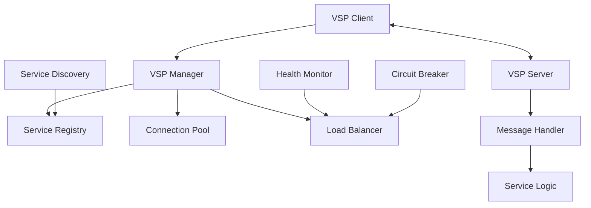

# VSP Protocol

The Velithon Service Protocol (VSP) is a high-performance, distributed communication protocol designed for microservices communication. VSP provides efficient service discovery, message passing, load balancing, and fault tolerance.

## 🌟 Features

- **High Performance**: Rust-based implementation with zero-copy operations
- **Service Discovery**: Automatic service registration and discovery
- **Load Balancing**: Built-in intelligent load balancing
- **Fault Tolerance**: Circuit breakers and health monitoring
- **Message Passing**: Efficient binary protocol
- **Connection Pooling**: Optimized connection management
- **Streaming Support**: Bidirectional streaming communication

## 🏗️ VSP Architecture



## 🚀 Quick Start

### Setting up VSP Server

```python
from velithon import Velithon
from velithon.vsp import VSPManager, VSPService

app = Velithon()

# Create VSP manager
vsp_manager = VSPManager(
    service_name="user-service",
    service_version="1.0.0",
    host="0.0.0.0",
    port=9090
)

# Register VSP manager with application
app.register_vsp(vsp_manager)

# Define VSP service
class UserService(VSPService):
    async def get_user(self, user_id: str) -> dict:
        # Business logic
        return {"id": user_id, "name": "John Doe"}
    
    async def create_user(self, user_data: dict) -> dict:
        # Create user logic
        return {"id": "123", **user_data}

# Register service
vsp_manager.register_service("UserService", UserService())

@app.on_startup()
async def startup():
    await vsp_manager.start()

@app.on_shutdown()
async def shutdown():
    await vsp_manager.stop()
```

### VSP Client

```python
from velithon.vsp import VSPClient

# Create VSP client
client = VSPClient(
    service_discovery_endpoints=["vsp://service-registry:9090"],
    connection_pool_size=10
)

# Call remote service
async def call_user_service():
    try:
        # Discover and call service
        result = await client.call(
            service="user-service",
            method="get_user",
            params={"user_id": "123"}
        )
        return result
    
    except VSPException as e:
        print(f"VSP call failed: {e}")
        return None

# Use in Velithon route
@app.get("/users/{user_id}")
async def get_user_proxy(request: Request):
    user_id = request.path_params["user_id"]
    user = await client.call(
        service="user-service",
        method="get_user", 
        params={"user_id": user_id}
    )
    return user
```

## 📡 Service Discovery

### Automatic Registration

```python
from velithon.vsp import VSPManager, ServiceDiscovery

# Configure service discovery
service_discovery = ServiceDiscovery(
    registry_endpoints=["vsp://registry-1:9090", "vsp://registry-2:9090"],
    health_check_interval=30,
    registration_ttl=60
)

vsp_manager = VSPManager(
    service_name="order-service",
    service_version="2.1.0",
    host="0.0.0.0",
    port=9091,
    service_discovery=service_discovery,
    metadata={
        "region": "us-west-2",
        "environment": "production",
        "capabilities": ["orders", "payments"]
    }
)

# Service automatically registers on startup
@app.on_startup()
async def startup():
    await vsp_manager.start()  # Automatic registration
```

### Manual Service Discovery

```python
from velithon.vsp.discovery import ServiceRegistry

registry = ServiceRegistry(endpoints=["vsp://registry:9090"])

# Discover services
@app.get("/services")
async def list_services():
    services = await registry.discover_services()
    return {"services": services}

# Discover specific service
@app.get("/services/{service_name}")
async def get_service_info(request: Request):
    service_name = request.path_params["service_name"]
    instances = await registry.discover_service(service_name)
    return {"service": service_name, "instances": instances}
```

## 🔄 Message Protocol

### Message Types

VSP supports different message types:

```python
from velithon.vsp.message import MessageType, VSPMessage

# Request message
request_msg = VSPMessage(
    type=MessageType.REQUEST,
    service="user-service",
    method="get_user",
    payload={"user_id": "123"},
    correlation_id="req-123"
)

# Response message
response_msg = VSPMessage(
    type=MessageType.RESPONSE,
    correlation_id="req-123",
    payload={"id": "123", "name": "John Doe"},
    status="success"
)

# Error message
error_msg = VSPMessage(
    type=MessageType.ERROR,
    correlation_id="req-123",
    payload={"error": "User not found", "code": 404}
)

# Event message
event_msg = VSPMessage(
    type=MessageType.EVENT,
    event_type="user.created",
    payload={"user_id": "123", "timestamp": "2025-01-01T00:00:00Z"}
)
```

### Custom Message Handlers

```python
from velithon.vsp import MessageHandler

class UserMessageHandler(MessageHandler):
    async def handle_request(self, message: VSPMessage) -> VSPMessage:
        method = message.method
        params = message.payload
        
        if method == "get_user":
            user = await self.get_user_from_db(params["user_id"])
            return VSPMessage.response(
                correlation_id=message.correlation_id,
                payload=user
            )
        
        elif method == "create_user":
            user = await self.create_user_in_db(params)
            return VSPMessage.response(
                correlation_id=message.correlation_id,
                payload=user
            )
        
        else:
            return VSPMessage.error(
                correlation_id=message.correlation_id,
                error="Method not found",
                code=404
            )
    
    async def handle_event(self, message: VSPMessage):
        if message.event_type == "user.updated":
            # Handle user update event
            await self.invalidate_user_cache(message.payload["user_id"])

# Register handler
vsp_manager.register_handler("user", UserMessageHandler())
```

## 🔧 Connection Management

### Connection Pooling

```python
from velithon.vsp.connection import ConnectionPool

# Configure connection pool
connection_pool = ConnectionPool(
    max_connections=50,
    max_connections_per_host=10,
    connection_timeout=30.0,
    idle_timeout=300.0,
    keep_alive_interval=60.0
)

client = VSPClient(connection_pool=connection_pool)
```

### Connection Strategies

```python
from velithon.vsp.transport import TransportConfig

# TCP transport with custom settings
tcp_config = TransportConfig(
    transport_type="tcp",
    buffer_size=8192,
    no_delay=True,
    keep_alive=True,
    compression="gzip"
)

# WebSocket transport
ws_config = TransportConfig(
    transport_type="websocket",
    max_message_size=1024*1024,  # 1MB
    ping_interval=30.0,
    compression="deflate"
)

vsp_manager = VSPManager(transport_config=tcp_config)
```

## ⚖️ Load Balancing

### Built-in Load Balancing

```python
from velithon.vsp.balancer import LoadBalancingStrategy

# Round-robin load balancing
client = VSPClient(
    load_balancing_strategy=LoadBalancingStrategy.ROUND_ROBIN
)

# Weighted load balancing
weighted_client = VSPClient(
    load_balancing_strategy=LoadBalancingStrategy.WEIGHTED,
    service_weights={
        "user-service-1": 3,
        "user-service-2": 2,
        "user-service-3": 1
    }
)

# Least connections
least_conn_client = VSPClient(
    load_balancing_strategy=LoadBalancingStrategy.LEAST_CONNECTIONS
)
```

### Custom Load Balancing

```python
from velithon.vsp.balancer import CustomLoadBalancer

class GeoLoadBalancer(CustomLoadBalancer):
    async def select_instance(self, service_instances: list, request_context: dict):
        client_region = request_context.get("region", "default")
        
        # Prefer instances in the same region
        same_region = [
            inst for inst in service_instances 
            if inst.metadata.get("region") == client_region
        ]
        
        if same_region:
            return self.round_robin_select(same_region)
        
        # Fallback to any available instance
        return self.round_robin_select(service_instances)

client = VSPClient(load_balancer=GeoLoadBalancer())
```

## 🔄 Streaming Communication

### Server Streaming

```python
from velithon.vsp import VSPStreamingService

class StreamingService(VSPStreamingService):
    async def stream_data(self, request_stream):
        async for message in request_stream:
            # Process each message
            result = await self.process_message(message.payload)
            yield VSPMessage.response(
                correlation_id=message.correlation_id,
                payload=result
            )

# Register streaming service
vsp_manager.register_streaming_service("data-stream", StreamingService())
```

### Client Streaming

```python
# Stream data to service
async def stream_data_to_service():
    async with client.stream("data-processor", "process_stream") as stream:
        for i in range(100):
            await stream.send({"data": f"item-{i}"})
            response = await stream.receive()
            print(f"Processed: {response.payload}")
```

### Bidirectional Streaming

```python
async def bidirectional_stream():
    async with client.bidirectional_stream("chat-service", "chat") as stream:
        # Send initial message
        await stream.send({"message": "Hello"})
        
        # Listen for responses while sending more messages
        async for response in stream:
            print(f"Received: {response.payload}")
            
            # Send response
            await stream.send({"message": f"Reply to {response.payload}"})
```

## 🛡️ Fault Tolerance

### Circuit Breaker

```python
from velithon.vsp.circuit_breaker import CircuitBreaker

circuit_breaker = CircuitBreaker(
    failure_threshold=5,
    timeout_duration=60.0,
    half_open_requests=3,
    success_threshold=2
)

client = VSPClient(circuit_breaker=circuit_breaker)

# Circuit breaker automatically handles failures
async def call_with_fallback():
    try:
        result = await client.call("unreliable-service", "get_data")
        return result
    except CircuitBreakerOpenError:
        # Fallback logic
        return {"data": "cached_fallback_data"}
```

### Retry Logic

```python
from velithon.vsp.retry import RetryConfig

retry_config = RetryConfig(
    max_attempts=3,
    backoff_factor=2.0,
    backoff_max=30.0,
    retryable_errors=["connection_error", "timeout"]
)

client = VSPClient(retry_config=retry_config)
```

### Health Monitoring

```python
from velithon.vsp.health import HealthMonitor

health_monitor = HealthMonitor(
    check_interval=30.0,
    timeout=5.0,
    failure_threshold=3,
    recovery_threshold=2
)

vsp_manager = VSPManager(health_monitor=health_monitor)

# Custom health check
@vsp_manager.health_check
async def custom_health_check():
    # Check database connection
    db_healthy = await check_database_connection()
    
    # Check external service
    service_healthy = await check_external_service()
    
    return {
        "status": "healthy" if db_healthy and service_healthy else "unhealthy",
        "details": {
            "database": "healthy" if db_healthy else "unhealthy",
            "external_service": "healthy" if service_healthy else "unhealthy"
        }
    }
```

## 📊 Monitoring and Observability

### Metrics Collection

```python
from velithon.vsp.metrics import VSPMetrics

metrics = VSPMetrics()

# Built-in metrics
@app.get("/vsp/metrics")
async def get_vsp_metrics():
    return {
        "requests_total": metrics.get_total_requests(),
        "requests_per_second": metrics.get_requests_per_second(),
        "average_latency": metrics.get_average_latency(),
        "error_rate": metrics.get_error_rate(),
        "active_connections": metrics.get_active_connections(),
        "service_health": metrics.get_service_health()
    }
```

### Distributed Tracing

```python
from velithon.vsp.tracing import VSPTracer

tracer = VSPTracer(
    service_name="user-service",
    jaeger_endpoint="http://jaeger:14268"
)

vsp_manager = VSPManager(tracer=tracer)

# Tracing is automatically enabled for all VSP calls
```

### Logging

```python
from velithon.vsp.logging import VSPLogger

logger = VSPLogger(
    level="INFO",
    format="json",
    include_request_id=True,
    include_trace_id=True
)

vsp_manager = VSPManager(logger=logger)
```

## 🔐 Security

### Authentication

```python
from velithon.vsp.security import VSPAuth

# JWT-based authentication
jwt_auth = VSPAuth.jwt(
    secret_key="your-secret-key",
    algorithm="HS256"
)

vsp_manager = VSPManager(auth=jwt_auth)

# API key authentication
api_key_auth = VSPAuth.api_key(
    header_name="X-VSP-API-Key",
    valid_keys=["key1", "key2"]
)
```

### Authorization

```python
from velithon.vsp.security import VSPAuthorization

class ServiceAuthorization(VSPAuthorization):
    async def authorize(self, service: str, method: str, user_context: dict) -> bool:
        user_roles = user_context.get("roles", [])
        
        # Admin can access everything
        if "admin" in user_roles:
            return True
        
        # User can only access user-related services
        if service == "user-service" and "user" in user_roles:
            return True
        
        return False

vsp_manager = VSPManager(authorization=ServiceAuthorization())
```

### TLS/SSL

```python
from velithon.vsp.tls import TLSConfig

tls_config = TLSConfig(
    cert_file="server.crt",
    key_file="server.key",
    ca_file="ca.crt",
    verify_client_certs=True
)

vsp_manager = VSPManager(tls_config=tls_config)
```

## 🌐 Service Mesh Integration

### Service Mesh Discovery

```python
from velithon.vsp.mesh import ServiceMesh

# Integrate with service mesh
service_mesh = ServiceMesh(
    mesh_type="istio",  # or "consul", "linkerd"
    discovery_endpoint="http://pilot:8080",
    enable_mTLS=True
)

vsp_manager = VSPManager(service_mesh=service_mesh)
```

### Traffic Management

```python
from velithon.vsp.mesh import TrafficPolicy

# Define traffic policies
traffic_policy = TrafficPolicy(
    canary_deployment={
        "version": "v2",
        "weight": 10  # 10% traffic to v2
    },
    circuit_breaker={
        "consecutive_errors": 5,
        "interval": 30,
        "base_ejection_time": 30
    },
    retry_policy={
        "attempts": 3,
        "per_try_timeout": 5
    }
)

vsp_manager.apply_traffic_policy(traffic_policy)
```

## 📋 Complete Example

```python
from velithon import Velithon
from velithon.vsp import VSPManager, VSPService, VSPClient

# Main application
app = Velithon()

# Configure VSP manager
vsp_manager = VSPManager(
    service_name="api-gateway",
    service_version="1.0.0",
    host="0.0.0.0",
    port=9090,
    service_discovery=ServiceDiscovery(
        registry_endpoints=["vsp://registry:9090"]
    ),
    health_monitor=HealthMonitor(check_interval=30),
    circuit_breaker=CircuitBreaker(failure_threshold=5),
    metrics=VSPMetrics(enable_prometheus=True)
)

# Register VSP manager
app.register_vsp(vsp_manager)

# VSP client for calling other services
client = VSPClient(
    service_discovery_endpoints=["vsp://registry:9090"],
    load_balancing_strategy=LoadBalancingStrategy.ROUND_ROBIN
)

# Gateway service
class GatewayService(VSPService):
    async def route_request(self, service: str, method: str, params: dict) -> dict:
        try:
            result = await client.call(service, method, params)
            return {"success": True, "data": result}
        except Exception as e:
            return {"success": False, "error": str(e)}

# Register service
vsp_manager.register_service("GatewayService", GatewayService())

# HTTP endpoints that use VSP
@app.get("/users/{user_id}")
async def get_user(request: Request):
    user_id = request.path_params["user_id"]
    result = await client.call(
        service="user-service",
        method="get_user",
        params={"user_id": user_id}
    )
    return result

@app.post("/orders")
async def create_order(request: Request):
    order_data = await request.json()
    result = await client.call(
        service="order-service",
        method="create_order",
        params=order_data
    )
    return result

# Lifecycle management
@app.on_startup()
async def startup():
    await vsp_manager.start()
    await client.start()

@app.on_shutdown()
async def shutdown():
    await client.stop()
    await vsp_manager.stop()

if __name__ == "__main__":
    app.run(vsp_host="0.0.0.0", vsp_port=9090)
```

## 🚀 Performance Optimization

### Connection Optimization

```python
# Optimize for high throughput
vsp_manager = VSPManager(
    connection_pool_size=100,
    max_concurrent_requests=1000,
    buffer_size=16384,
    enable_compression=True,
    compression_level=6
)
```

### Memory Management

```python
# Configure memory settings
vsp_manager = VSPManager(
    max_message_size=1024*1024,  # 1MB
    message_buffer_size=8192,
    enable_zero_copy=True,
    memory_pool_size=50
)
```

## 📚 Next Steps

- **[Connection Pooling](connection-pooling.md)** - Advanced connection management
- **[Load Balancing](load-balancing.md)** - VSP load balancing strategies  
- **[Performance Optimization](performance.md)** - VSP performance tuning
- **[Deployment](../deployment/production.md)** - Production VSP deployment
